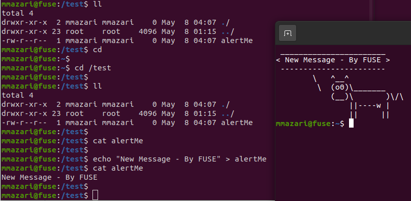

# Filesystem in Userspace (FUSE)
This code will be responsible for modifying the cowsay command in .bashrc using some mounted file by FUSE (which is alertMe in this example).
As a result, to view the text that is being displayed by cowsay command, you need to read alertMe file in the mount point.
Also, to change the text, you can write on the file using echo and redirecting command `echo 'New Text' > alertMe`.

##### FUSE Installation: 
```bash
$ sudo apt install libfuse-dev
```

##### Compilation Command: 
```bash
$ gcc fuse.c alert_text.c fuse_operations.c -o myFUSE `pkg-config fuse --cflags --libs`
```


##### Running Exmaple: 
```bash
$ ./myFUSE /anyDirectory
```
You may use -f arguement to view the log output.

##### Screenshot: 

